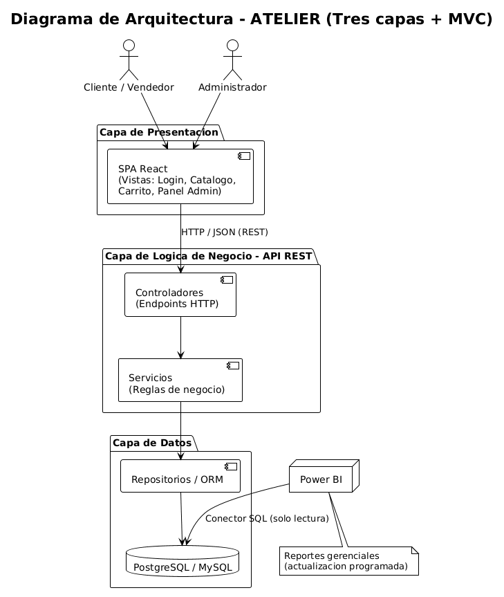
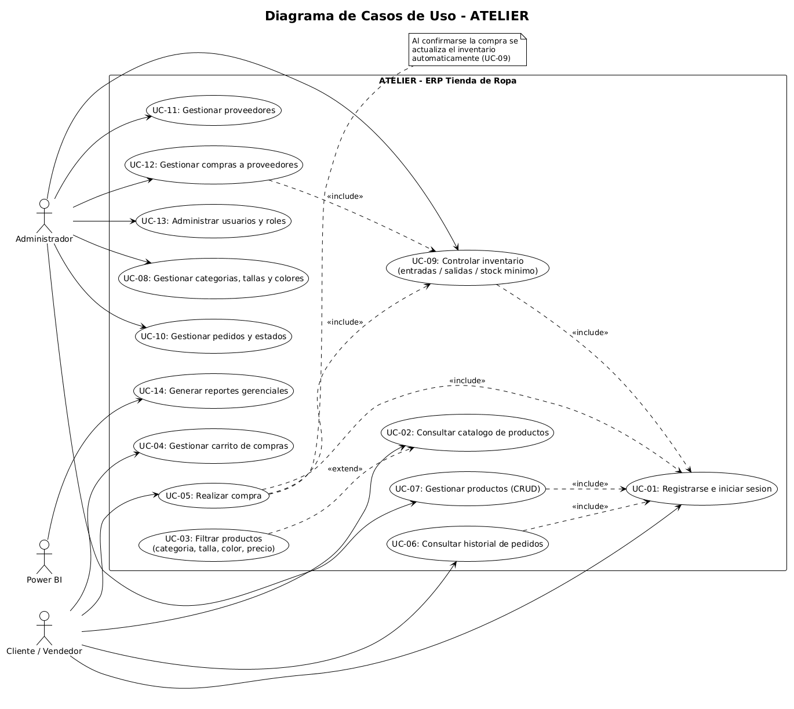
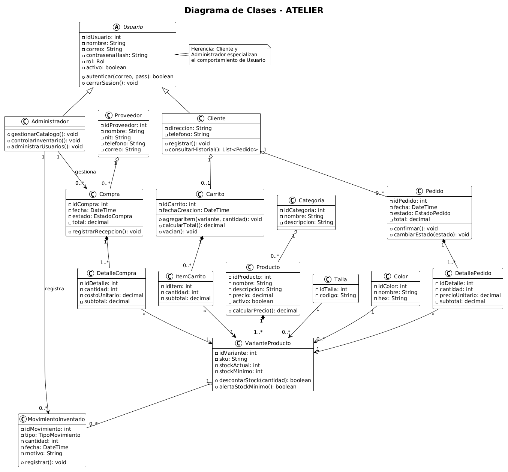
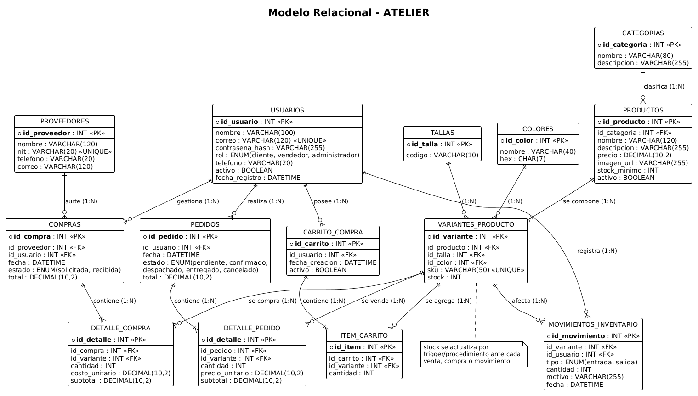

# ATELIER — Documentación de Análisis y Diseño del Sistema

**ERP para Tienda de Ropa**

| | |
|---|---|
| **Universidad** | Universidad Manuela Beltrán |
| **Asignatura** | Sistema Transaccional |
| **Grupo** | 6 |
| **Autores** | Juan Esteban Cabral Bautista · Laura Valentina Ruiz Vaca · Steven Rusinque Gutierrez |
| **Fecha** | Septiembre de 2026 |

---

## 1. Información general del proyecto

### 1.1 Nombre del sistema

**ATELIER** — ERP para Tienda de Ropa.

### 1.2 Descripción general

ATELIER es un sistema transaccional tipo ERP (Enterprise Resource Planning) para la gestión integral de una tienda de ropa. La plataforma centraliza la administración del catálogo de productos, el inventario, las ventas, las compras a proveedores y los reportes gerenciales, con dos perfiles de usuario: **cliente/vendedor** y **administrador**.

### 1.3 Problemática o necesidad identificada

Las tiendas de ropa que administran sus procesos de forma manual o con herramientas aisladas (hojas de cálculo, cuadernos, sistemas no integrados) enfrentan problemas recurrentes:

- Información de inventario desactualizada o inconsistente.
- Ventas de productos sin existencias disponibles.
- Dificultad para conocer la rotación de productos y los niveles de stock.
- Ausencia de reportes confiables para decidir compras a proveedores.
- Falta de trazabilidad sobre quién realizó cada operación y cuándo.

### 1.4 Justificación

Un ERP integrado resuelve la problemática anterior al centralizar la información en una única base de datos, garantizar la consistencia entre ventas e inventario mediante reglas de negocio claras y ofrecer trazabilidad completa de las operaciones. Además, la integración con Power BI convierte los datos operativos en información gerencial útil para la toma de decisiones del propietario y el administrador de la tienda.

### 1.5 Alcance de la solución

**Dentro del alcance:**

- Registro e inicio de sesión de usuarios con roles (cliente, vendedor y administrador).
- Gestión de productos (CRUD), categorías, tallas y colores.
- Consulta de catálogo con filtros y disponibilidad en tiempo real.
- Carrito de compras, registro de ventas y pedidos, e historial de pedidos.
- Control de inventario: entradas, salidas, actualización automática de stock y alertas de stock mínimo.
- Gestión de compras a proveedores y de proveedores.
- Reportes gerenciales visualizados mediante Power BI.

**Fuera del alcance:**

- Integración con pasarelas de pago reales (el proceso de pago se simula).
- Logística y seguimiento de envíos por transportadoras.
- Módulos de contabilidad, facturación electrónica o nómina.
- Aplicación móvil nativa (la solución será una aplicación web responsive).

---

## 2. Objetivo central

Desarrollar un ERP que permita gestionar de manera eficiente e integrada los procesos de una tienda de ropa —catálogo de productos, inventario, ventas, compras a proveedores y análisis de datos—, garantizando la consistencia de la información, la trazabilidad de las operaciones y la generación de reportes de apoyo a la toma de decisiones, de modo que se eliminen las inconsistencias de inventario y las ventas de productos sin existencias identificadas en la problemática.

---

## 3. Objetivos específicos

1. Implementar un catálogo de productos administrable (categorías, tallas, colores y precios) con consulta de disponibilidad en tiempo real.
2. Controlar el inventario mediante el registro de entradas y salidas, la definición de stock mínimo y la generación de alertas de reposición.
3. Soportar el proceso de venta en línea: carrito de compras, registro de pedidos y consulta del historial por parte del cliente o vendedor.
4. Gestionar las compras a proveedores y la recepción de mercancía, integrándolas automáticamente con el inventario.
5. Proveer reportes gerenciales integrados con Power BI para el análisis de ventas, productos e inventario.

---

## 4. Arquitectura de software

### 4.1 Tipo de arquitectura seleccionada

El sistema adopta una **arquitectura de tres capas** (presentación, lógica de negocio y datos), complementada con el **patrón MVC** (Modelo–Vista–Controlador) en la capa de aplicación, y un estilo **cliente-servidor** para la comunicación entre el navegador y el servidor mediante una API REST.

### 4.2 Componentes principales del sistema

| Capa | Componente | Función |
|---|---|---|
| Presentación | Interfaz web (vistas) | Catálogo, carrito, panel de administración e historial de pedidos con los que interactúan los usuarios. |
| Presentación | Controladores (MVC) | Reciben las solicitudes HTTP, validan entradas y delegan en la lógica de negocio. |
| Lógica de negocio | Servicios de dominio | Implementan las reglas de negocio: validación de stock, cálculo de totales, estados de pedido, alertas de stock mínimo. |
| Lógica de negocio | Control de acceso (RBAC) | Autenticación de usuarios y autorización por rol (cliente, vendedor, administrador). |
| Datos | Capa de persistencia (ORM) | Traduce los objetos del dominio a operaciones sobre la base de datos relacional. |
| Datos | Base de datos relacional | Almacena usuarios, productos, variantes, inventario, pedidos, compras y proveedores. |
| Externo | Power BI | Consume los datos del sistema para construir los tableros gerenciales. |

### 4.3 Comunicación entre componentes

- El **navegador** del usuario se comunica con el servidor mediante peticiones **HTTP/HTTPS** a la API REST, intercambiando datos en formato **JSON**.
- Los **controladores** invocan los **servicios de dominio**, que aplican las reglas de negocio antes de persistir cualquier cambio.
- La capa de negocio accede a los datos a través del **ORM**, que ejecuta las consultas **SQL** sobre la base de datos.
- **Power BI** se conecta a la base de datos en modo de solo lectura para alimentar los reportes, sin interferir con las transacciones operativas.

### 4.4 Justificación de la arquitectura

La arquitectura de tres capas es adecuada para ATELIER porque:

- **Separación de responsabilidades:** la interfaz, las reglas de negocio y los datos evolucionan de forma independiente, lo que facilita el mantenimiento.
- **Gestión de la consistencia transaccional:** concentrar las reglas de negocio (stock, estados de pedido) en una sola capa facilita la gestión de la integridad que exige un sistema transaccional. La consistencia efectiva no la provee la arquitectura por sí misma: dependerá de la implementación posterior de transacciones, restricciones de integridad (PK, FK, CHECK) y mecanismos de control de concurrencia en la capa de datos.
- **Escalabilidad:** permite crecer de forma horizontal en la capa de presentación sin modificar la lógica ni los datos.
- **Compatibilidad con Power BI:** la separación de la capa de datos permite que la herramienta de analítica lea directamente el modelo relacional.
- **Madurez y soporte:** es un modelo ampliamente documentado, con abundantes frameworks y buenas prácticas disponibles para el equipo.

---

## 5. Diagrama de casos de uso UML

### 5.1 Actores del sistema

| Actor | Descripción |
|---|---|
| **Cliente / Vendedor** | Usuario registrado que consulta el catálogo, realiza compras y consulta su historial. El vendedor opera el sistema en el punto de venta físico. |
| **Administrador** | Responsable de la gestión integral: productos, inventario, ventas, compras, proveedores, usuarios y reportes. |
| **Power BI** *(sistema externo)* | Consume los datos del ERP para la generación de tableros gerenciales. |

### 5.2 Descripción de los casos de uso principales

#### CU-01. Realizar compra

| Campo | Detalle |
|---|---|
| **Nombre** | Realizar compra |
| **Actor principal** | Cliente / Vendedor |
| **Objetivo** | Permitir al usuario seleccionar productos del catálogo y generar un pedido. |
| **Precondiciones** | El usuario está registrado y autenticado; existen productos con stock disponible. |
| **Flujo principal** | 1. El usuario consulta el catálogo y aplica filtros (categoría, talla, color, precio). 2. Selecciona un producto y lo agrega al carrito con la cantidad deseada. 3. El sistema valida la disponibilidad en tiempo real. 4. El usuario revisa el carrito y confirma la compra. 5. El sistema calcula el total, registra el pedido en estado "pendiente" y descuenta el stock. 6. El sistema muestra la confirmación con el número de pedido. |
| **Resultado esperado** | Pedido registrado, inventario actualizado y compra visible en el historial del usuario. |

#### CU-02. Gestionar productos

| Campo | Detalle |
|---|---|
| **Nombre** | Gestionar productos |
| **Actor principal** | Administrador |
| **Objetivo** | Crear, consultar, actualizar o eliminar productos del catálogo. |
| **Precondiciones** | El administrador ha iniciado sesión con rol de administrador. |
| **Flujo principal** | 1. El administrador ingresa al módulo de catálogo. 2. Selecciona la opción de crear producto. 3. Diligencia nombre, descripción, categoría, tallas, colores, precio e imagen. 4. El sistema valida los datos obligatorios y guarda el producto. 5. El producto queda visible en el catálogo. |
| **Resultado esperado** | Catálogo actualizado y cambios registrados en la bitácora de auditoría. |

#### CU-03. Controlar inventario

| Campo | Detalle |
|---|---|
| **Nombre** | Controlar inventario |
| **Actor principal** | Administrador |
| **Objetivo** | Registrar entradas y salidas de inventario y atender las alertas de reposición. |
| **Precondiciones** | El administrador está autenticado; existen productos registrados. |
| **Flujo principal** | 1. El administrador ingresa al módulo de inventario. 2. Selecciona la variante del producto y registra una entrada o salida con cantidad y motivo. 3. El sistema actualiza las existencias y guarda el movimiento con fecha y usuario. 4. Si el stock resultante alcanza el stock mínimo, el sistema genera una alerta. |
| **Resultado esperado** | Inventario actualizado con trazabilidad completa de los movimientos. |

#### CU-04. Gestionar compras a proveedores

| Campo | Detalle |
|---|---|
| **Nombre** | Gestionar compras a proveedores |
| **Actor principal** | Administrador |
| **Objetivo** | Registrar órdenes de compra y confirmar la recepción de mercancía. |
| **Precondiciones** | El administrador está autenticado; existen proveedores y productos registrados. |
| **Flujo principal** | 1. El administrador ingresa al módulo de compras. 2. Selecciona el proveedor y los productos a comprar con sus cantidades. 3. El sistema calcula el total y registra la compra en estado "pendiente". 4. Al confirmar la recepción, el sistema incrementa automáticamente el inventario. |
| **Resultado esperado** | Compra registrada y stock incrementado tras la recepción confirmada. |

#### CU-05. Visualizar reportes gerenciales

| Campo | Detalle |
|---|---|
| **Nombre** | Visualizar reportes gerenciales |
| **Actor principal** | Administrador (con Power BI como sistema de apoyo) |
| **Objetivo** | Consultar tableros con indicadores de ventas, productos e inventario. |
| **Precondiciones** | El administrador está autenticado; existen datos operativos en el sistema. |
| **Flujo principal** | 1. El administrador ingresa al módulo de reportes. 2. Selecciona el tablero deseado (ventas, productos más vendidos, rotación de inventario). 3. El sistema presenta el tablero de Power BI con los datos actualizados. |
| **Resultado esperado** | El administrador obtiene información gerencial para la toma de decisiones. |

---

## 6. Diagrama de clases UML

### 6.1 Clases principales del sistema

| Clase | Atributos | Métodos principales |
|---|---|---|
| **Usuario** | idUsuario, nombre, correo, contrasenaHash, fechaRegistro | registrarse(), iniciarSesion(), cerrarSesion(), actualizarPerfil() |
| **Cliente** *(hereda de Usuario)* | direccionEnvio | consultarHistorial() |
| **Vendedor** *(hereda de Usuario)* | codigoEmpleado | registrarVentaPresencial() |
| **Administrador** *(hereda de Usuario)* | — | gestionarUsuarios(), gestionarCatalogo(), gestionarInventario(), gestionarCompras() |
| **Producto** | idProducto, nombre, descripcion, precio, imagenUrl, stockMinimo, activo | crear(), actualizar(), desactivar(), verificarStockMinimo() |
| **Categoria** | idCategoria, nombre, descripcion | crear(), actualizar(), eliminar() |
| **Talla** | idTalla, etiqueta | crear(), eliminar() |
| **Color** | idColor, nombre, codigoHex | crear(), eliminar() |
| **VarianteProducto** | idVariante, sku, stock | aumentarStock(cantidad), disminuirStock(cantidad), consultarDisponibilidad() |
| **CarritoCompra** | idCarrito, fechaCreacion | agregarItem(), eliminarItem(), vaciar(), calcularTotal() |
| **ItemCarrito** | cantidad | actualizarCantidad(), calcularSubtotal() |
| **Pedido** | idPedido, fecha, estado, total | confirmar(), despachar(), entregar(), cancelar(), calcularTotal() |
| **DetallePedido** | cantidad, precioUnitario, subtotal | calcularSubtotal() |
| **MovimientoInventario** | idMovimiento, tipo, cantidad, motivo, fecha | registrar() |
| **Proveedor** | idProveedor, nombre, contacto, correo, telefono | crear(), actualizar(), desactivar() |
| **Compra** | idCompra, fecha, estado, total | registrar(), confirmarRecepcion(), calcularTotal() |
| **DetalleCompra** | cantidad, costoUnitario, subtotal | calcularSubtotal() |

### 6.2 Relaciones entre clases

| Relación | Tipo | Multiplicidad | Descripción |
|---|---|---|---|
| Usuario — Cliente / Vendedor / Administrador | Herencia | — | El rol del usuario se representa mediante especialización. |
| Categoria — Producto | Asociación | 1 a 0..* | Un producto pertenece a una categoría. |
| Producto — VarianteProducto | Composición | 1 a 1..* | Todo producto tiene al menos una variante (talla + color). |
| Talla — VarianteProducto | Asociación | 1 a 0..* | Cada variante referencia una talla. |
| Color — VarianteProducto | Asociación | 1 a 0..* | Cada variante referencia un color. |
| Usuario — CarritoCompra | Asociación | 1 a 0..1 | Cada usuario tiene un carrito activo. |
| CarritoCompra — ItemCarrito | Composición | 1 a 0..* | El carrito contiene ítems. |
| ItemCarrito — VarianteProducto | Asociación | * a 1 | Cada ítem referencia una variante. |
| Usuario — Pedido | Asociación | 1 a 0..* | Un usuario realiza cero o más pedidos. |
| Pedido — DetallePedido | Composición | 1 a 1..* | Todo pedido tiene al menos un detalle. |
| DetallePedido — VarianteProducto | Asociación | * a 1 | Cada detalle referencia una variante. |
| VarianteProducto — MovimientoInventario | Asociación | 1 a 0..* | Los movimientos se registran por variante. |
| Usuario — MovimientoInventario | Asociación | 1 a 0..* | Trazabilidad: qué usuario registró el movimiento. |
| Proveedor — Compra | Asociación | 1 a 0..* | Un proveedor recibe cero o más compras. |
| Compra — DetalleCompra | Composición | 1 a 1..* | Toda compra tiene al menos un detalle. |
| DetalleCompra — VarianteProducto | Asociación | * a 1 | Cada detalle referencia una variante. |

---

## 7. Modelo relacional

### 7.1 Tablas y campos

**usuario**

| Campo | Tipo | Clave | Descripción |
|---|---|---|---|
| id_usuario | SERIAL | **PK** | Identificador único del usuario |
| nombre | VARCHAR(100) | | Nombre completo |
| correo | VARCHAR(120) | UNIQUE | Correo electrónico |
| contrasena_hash | VARCHAR(255) | | Contraseña cifrada |
| rol | VARCHAR(20) | | cliente / vendedor / administrador |
| fecha_registro | TIMESTAMP | | Fecha de registro |

**categoria**

| Campo | Tipo | Clave | Descripción |
|---|---|---|---|
| id_categoria | SERIAL | **PK** | Identificador de la categoría |
| nombre | VARCHAR(60) | | Nombre de la categoría |
| descripcion | TEXT | | Descripción |

**talla**

| Campo | Tipo | Clave | Descripción |
|---|---|---|---|
| id_talla | SERIAL | **PK** | Identificador de la talla |
| etiqueta | VARCHAR(10) | | Ej.: XS, S, M, L, XL |

**color**

| Campo | Tipo | Clave | Descripción |
|---|---|---|---|
| id_color | SERIAL | **PK** | Identificador del color |
| nombre | VARCHAR(40) | | Nombre del color |
| codigo_hex | CHAR(7) | | Código hexadecimal (ej.: #1F4E4E) |

**producto**

| Campo | Tipo | Clave | Descripción |
|---|---|---|---|
| id_producto | SERIAL | **PK** | Identificador del producto |
| nombre | VARCHAR(120) | | Nombre del producto |
| descripcion | TEXT | | Descripción |
| precio | NUMERIC(10,2) | | Precio de venta |
| imagen_url | VARCHAR(255) | | Imagen del producto |
| stock_minimo | INT | | Umbral de alerta de reposición |
| activo | BOOLEAN | | Producto visible en el catálogo |
| id_categoria | INT | **FK → categoria** | Categoría del producto |

**variante_producto**

| Campo | Tipo | Clave | Descripción |
|---|---|---|---|
| id_variante | SERIAL | **PK** | Identificador de la variante |
| sku | VARCHAR(40) | UNIQUE | Código único de la variante |
| stock | INT | | Existencias actuales |
| id_producto | INT | **FK → producto** | Producto al que pertenece |
| id_talla | INT | **FK → talla** | Talla de la variante |
| id_color | INT | **FK → color** | Color de la variante |

**pedido**

| Campo | Tipo | Clave | Descripción |
|---|---|---|---|
| id_pedido | SERIAL | **PK** | Identificador del pedido |
| fecha | TIMESTAMP | | Fecha de creación |
| estado | VARCHAR(20) | | pendiente / confirmado / despachado / entregado / cancelado |
| total | NUMERIC(12,2) | | Total del pedido |
| id_usuario | INT | **FK → usuario** | Usuario que realizó el pedido |

**detalle_pedido**

| Campo | Tipo | Clave | Descripción |
|---|---|---|---|
| id_detalle | SERIAL | **PK** | Identificador del detalle |
| cantidad | INT | | Cantidad comprada |
| precio_unitario | NUMERIC(10,2) | | Precio al momento de la venta |
| subtotal | NUMERIC(12,2) | | cantidad × precio_unitario |
| id_pedido | INT | **FK → pedido** | Pedido al que pertenece |
| id_variante | INT | **FK → variante_producto** | Variante vendida |

**carrito_compra**

| Campo | Tipo | Clave | Descripción |
|---|---|---|---|
| id_carrito | SERIAL | **PK** | Identificador del carrito |
| fecha_creacion | TIMESTAMP | | Fecha de creación del carrito |
| activo | BOOLEAN | | Indica si el carrito está vigente |
| id_usuario | INT | **FK → usuario** | Usuario propietario del carrito |

**item_carrito**

| Campo | Tipo | Clave | Descripción |
|---|---|---|---|
| id_item | SERIAL | **PK** | Identificador del ítem |
| cantidad | INT | | Cantidad de la variante en el carrito |
| id_carrito | INT | **FK → carrito_compra** | Carrito al que pertenece |
| id_variante | INT | **FK → variante_producto** | Variante agregada al carrito |

**movimiento_inventario**

| Campo | Tipo | Clave | Descripción |
|---|---|---|---|
| id_movimiento | SERIAL | **PK** | Identificador del movimiento |
| tipo | VARCHAR(10) | | entrada / salida |
| cantidad | INT | | Unidades del movimiento |
| motivo | VARCHAR(200) | | venta, compra, ajuste, etc. |
| fecha | TIMESTAMP | | Fecha del movimiento |
| id_variante | INT | **FK → variante_producto** | Variante afectada |
| id_usuario | INT | **FK → usuario** | Usuario que registró el movimiento |

**proveedor**

| Campo | Tipo | Clave | Descripción |
|---|---|---|---|
| id_proveedor | SERIAL | **PK** | Identificador del proveedor |
| nombre | VARCHAR(120) | | Nombre o razón social |
| contacto | VARCHAR(100) | | Persona de contacto |
| correo | VARCHAR(120) | | Correo electrónico |
| telefono | VARCHAR(20) | | Teléfono |

**compra**

| Campo | Tipo | Clave | Descripción |
|---|---|---|---|
| id_compra | SERIAL | **PK** | Identificador de la compra |
| fecha | TIMESTAMP | | Fecha de la orden |
| estado | VARCHAR(20) | | pendiente / recibida / cancelada |
| total | NUMERIC(12,2) | | Total de la compra |
| id_proveedor | INT | **FK → proveedor** | Proveedor de la compra |

**detalle_compra**

| Campo | Tipo | Clave | Descripción |
|---|---|---|---|
| id_detalle | SERIAL | **PK** | Identificador del detalle |
| cantidad | INT | | Cantidad comprada |
| costo_unitario | NUMERIC(10,2) | | Costo por unidad |
| subtotal | NUMERIC(12,2) | | cantidad × costo_unitario |
| id_compra | INT | **FK → compra** | Compra a la que pertenece |
| id_variante | INT | **FK → variante_producto** | Variante comprada |

### 7.2 Relaciones y cardinalidades

| Relación | Cardinalidad | Lectura |
|---|---|---|
| categoria — producto | 1 : N | Una categoría agrupa muchos productos; un producto pertenece a una categoría. |
| producto — variante_producto | 1 : N | Un producto tiene una o más variantes; cada variante pertenece a un producto. |
| talla — variante_producto | 1 : N | Una talla aplica a muchas variantes. |
| color — variante_producto | 1 : N | Un color aplica a muchas variantes. |
| usuario — pedido | 1 : N | Un usuario realiza muchos pedidos; cada pedido es de un usuario. |
| pedido — detalle_pedido | 1 : N | Un pedido tiene uno o más detalles. |
| usuario — carrito_compra | 1 : N | Un usuario puede tener varios carritos a lo largo del tiempo; cada carrito pertenece a un usuario. |
| carrito_compra — item_carrito | 1 : N | Un carrito contiene uno o más ítems; cada ítem pertenece a un carrito. |
| variante_producto — item_carrito | 1 : N | Una variante puede aparecer en los ítems de muchos carritos. |
| variante_producto — detalle_pedido | 1 : N | Una variante puede aparecer en muchos detalles de pedido. |
| variante_producto — movimiento_inventario | 1 : N | Una variante acumula muchos movimientos de inventario. |
| usuario — movimiento_inventario | 1 : N | Un usuario registra muchos movimientos (trazabilidad). |
| proveedor — compra | 1 : N | Un proveedor recibe muchas compras. |
| compra — detalle_compra | 1 : N | Una compra tiene uno o más detalles. |
| variante_producto — detalle_compra | 1 : N | Una variante puede aparecer en muchos detalles de compra. |

> **Nota de correspondencia:** cada clase del diagrama de clases (sección 6) tiene su tabla equivalente en el modelo relacional; la herencia de `Usuario` se resuelve con el atributo `rol` en la tabla `usuario`, y las composiciones (`Pedido–DetallePedido`, `Compra–DetalleCompra`, `Producto–VarianteProducto`) se implementan mediante claves foráneas obligatorias.

---

## 8. Integración de los modelos

La coherencia entre los elementos de la documentación se demuestra en la siguiente trazabilidad: cada objetivo específico se materializa en funcionalidades, que se modelan como casos de uso, se estructuran en clases y se persisten en tablas del modelo relacional, todo dentro de la arquitectura de tres capas.

| Objetivo específico | Funcionalidad | Caso de uso | Clases involucradas | Tablas involucradas |
|---|---|---|---|---|
| OE-1 Catálogo | Gestión y consulta del catálogo | CU-02 Gestionar productos | Producto, Categoria, Talla, Color, VarianteProducto | producto, categoria, talla, color, variante_producto |
| OE-2 Inventario | Control de entradas, salidas y stock mínimo | CU-03 Controlar inventario | VarianteProducto, MovimientoInventario, Producto | variante_producto, movimiento_inventario, producto |
| OE-3 Ventas | Carrito, pedido e historial | CU-01 Realizar compra | Usuario, CarritoCompra, ItemCarrito, Pedido, DetallePedido, VarianteProducto | usuario, carrito_compra, item_carrito, pedido, detalle_pedido, variante_producto |
| OE-4 Compras | Compras a proveedores y recepción | CU-04 Gestionar compras a proveedores | Proveedor, Compra, DetalleCompra, VarianteProducto | proveedor, compra, detalle_compra, variante_producto |
| OE-5 Reportes | Tableros gerenciales | CU-05 Visualizar reportes gerenciales | (lectura vía Power BI sobre el modelo de datos) | usuario, pedido, detalle_pedido, variante_producto, movimiento_inventario, compra |
| Transversal | Autenticación y control de acceso | Autenticarse («include») | Usuario, Cliente, Vendedor, Administrador | usuario |

**Ejemplo de coherencia extremo a extremo:** la funcionalidad *realizar compra* (CU-01) exige validar stock, regla que se implementa en el método `consultarDisponibilidad()` de la clase `VarianteProducto`, persiste el pedido en las tablas `pedido` y `detalle_pedido`, y actualiza el campo `stock` de `variante_producto` dentro de una transacción en la capa de lógica de negocio de la arquitectura.

---

## 9. Conclusiones

1. La documentación de análisis y diseño permitió transformar la idea inicial de ATELIER en una propuesta estructurada: se definieron el objetivo central, cinco objetivos específicos, la arquitectura de tres capas con MVC, cinco casos de uso principales, un modelo de clases de 17 clases y un modelo relacional de 14 tablas.
2. La arquitectura de tres capas resulta coherente con la naturaleza transaccional del sistema, pues concentra las reglas de negocio críticas (validación de stock, estados de pedido, alertas de inventario) en una única capa, lo que facilita la gestión de la consistencia de la información; su garantía definitiva dependerá de la correcta implementación de transacciones, restricciones y control de concurrencia en la fase de desarrollo.
3. La trazabilidad establecida entre problemática, objetivos, funcionalidades, casos de uso, clases y modelo relacional demuestra que los modelos no son independientes, sino vistas complementarias de la misma solución.
4. En las siguientes etapas del proyecto deberán desarrollarse: el diseño detallado de la interfaz de usuario, la implementación de la base de datos, el backend de la API REST, la integración con Power BI y el plan de pruebas del sistema.

---

## 10. Referencias

- Elmasri, R., & Navathe, S. B. (2007). *Fundamentos de sistemas de bases de datos* (5.ª ed.). Pearson Educación.
- Fowler, M. (2004). *UML distilled: A brief guide to the standard object modeling language* (3.ª ed.). Addison-Wesley.
- Object Management Group. (2017). *OMG Unified Modeling Language (OMG UML), Version 2.5.1*. https://www.omg.org/spec/UML/2.5.1
- Pressman, R. S., & Maxim, B. R. (2021). *Ingeniería del software: un enfoque práctico* (9.ª ed.). McGraw-Hill Education.
- Sommerville, I. (2011). *Ingeniería de software* (9.ª ed.). Pearson Educación.
